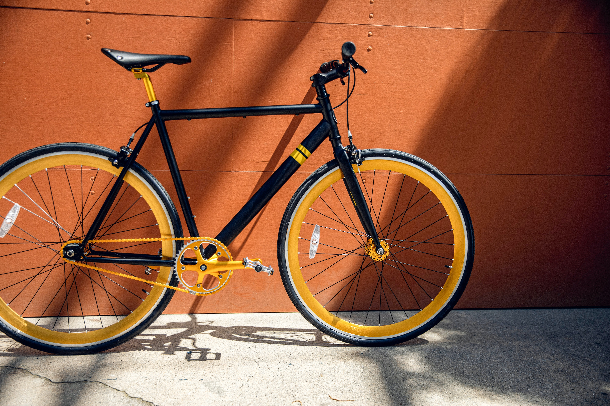
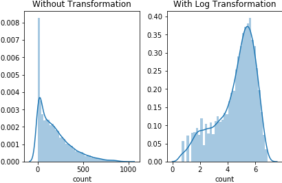
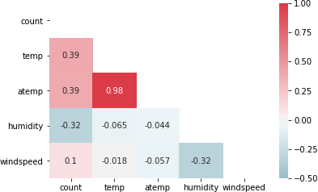
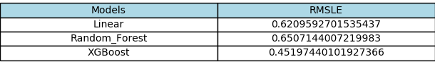
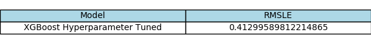

# Bike Share Demand Forecast - Kaggle Competition

    

## Description
Bike sharing systems are a means of renting bicycles where the process of obtaining membership, rental, and bike return is automated via a network of kiosk locations throughout a city. Using these systems, people are able rent a bike from a one location and return it to a different place on an as-needed basis. Currently, there are over 500 bike-sharing programs around the world.

The data generated by these systems makes them attractive for researchers because the duration of travel, departure location, arrival location, and time elapsed is explicitly recorded. Bike sharing systems therefore function as a sensor network, which can be used for studying mobility in a city. In this competition, participants are asked to combine historical usage patterns with weather data in order to forecast bike rental demand in the Capital Bikeshare program in Washington, D.C.

The training set is comprised of the first 19 days of each month, while the test set is the 20th to the end of the month. The objective is to predict the total count of bikes rented during each hour covered by the test set, using only information available prior to the rental period.

## Objective
In this project, I will:
* Perform EDA on the bike sharing training data and inform the feature selection / engineering to be fed into the models. 
* Create pipelines to preprocess the data and train several models before selecting a champion model. 
* Predict the bike share demand of the test data.

## Exploratory Analysis

### Dependent Variable Univeraiate Analysis

I first performed  univariate analyses for all variables. In particular, the dependent variable _count_ has an interesting distribution.

The figure on the left is the distribution before a transformation is applied to the _count_ variable. It is clear that the distribution is skewed to the right. One of the Ordinary Least Squares assumption (required for linear regression) is to have the error term be normally distributed. After applying a log transformation, the distribution looks closer to a bell curve. This transformation is applied for Linear Regression and XGBoost.

### Correlation Matrix

I also looked at the correlation matrix for all the numerical variables.

From the correlation matrix above, there are a couple important inferences made:
* _windspeed_ is not really correlated with _count_ - we will exclude windspeed from the models
* _temp_ and _atemp_ are highly correlated - we will only include _atemp_ in the models

### Categorical Variables 

Lastly, I performed bivariate analyses, looking at the categorical variables and their interaction with the dependent variable.

From the figures above, we noticed that:
* Spring has a relatively lower number of _count_, and a smaller interquartile range. Seems there is just less demand in Spring
* Clear skies, as expected, have the most bike demand
* There is more demand of bike share around 7am and 5pm. Hour will be an important dependent variable

## Data Preprocessing

### Feature Selection

I abstained from using functions such as _SelectKBest_. Instead, I heavily relied on my EDA to determine what variables to use in my mdoels.
* Numerical Variables used: ['atemp', 'humidity']
* Categorical Variables used: ['weather', 'season', 'workingday']

### Feature Engineering 

Feature Engineering was performed to extract the year, month, and day from the _datetime_ variable. 

### Pipelines

A pipeline was used for all data preprocessing and transformation steps. 
* Numerical variables were scaled when training the linear regression model. 
* Categorical variables were One Hot Encoded. 
* Feature engineered variables from the _datetime_ column were also One Hot Encoded

## Models

In order to evaluate our models, we utilized root mean squared logarithmic error (RMSLE). The equation of RMSLE is as follows:

I utilized 3 models during my model selection process. Linear Regerssion was used as the baseline model. The challenger models are Random Forest and XGBoost. Using cross validation with 5 folds, I determined the RMSLE for these 3 models. 

XGBoost had the lowest RMSLE, so it was chosen as the champion model. In order to further improve its performance, I performed hyperparameter tuning to calibrate the hyperparameters. In the end, the model with the most optimal hyperparameters had the following RMSLE.

## Champion Model Testing Results

The champion model had an RMLSE of 0.41527 on the testing data when submitted to Kaggle.
